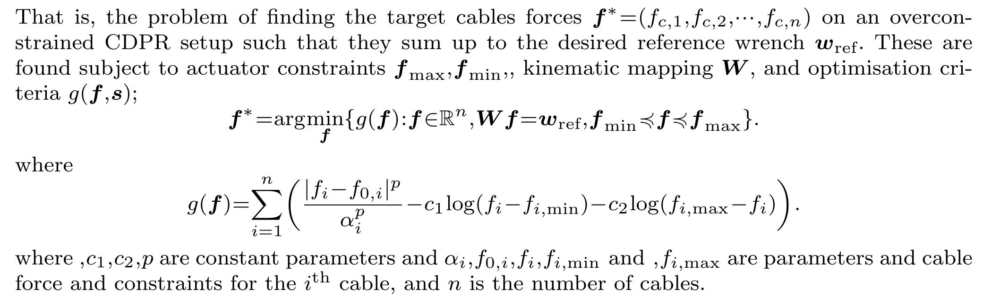
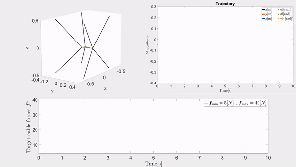

# Force allocation for Cable driven parallel robots (MATLAB)

This repository considers methods for force-allocation onto overconstrained CDPR setups.

  

We refer to the paper *Optimal Force Allocation for Overconstrained Cable-Driven Parallel Robots: Continuously
Differentiable Solutions with Assessment of Computational Efficiency*, by Ueland E, Sauder T, Skjetne R for documentation on included methods. 

## Other

Try running *QuickExample.m* for a quick demonstration. 

-Make sure to add the whole folder with subfolders to your MATLAB path.

-Verified to be working in MATLAB 2019a.

-For older versions of MATLAB, one need to rerun COMPILEC_CODE.m to regenerate C-Code. (you may need an appropriate C-Compiler).

-For versions earlier than MATLAB 2018a, the syntax for manipulating Figures is different, such that some adaptations are needed to reproduce the figures.

-There is little use of internal MATLAB functions, so there should not be a need for many MATLAB packages excluding the standard ones.

Toolbox may be expanded in the future.
