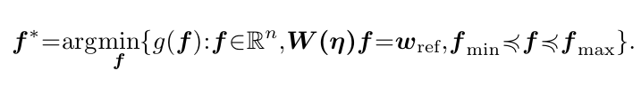

The following are methods and for force-allocation onto overconstrained CDPR setups.

See the paper "Optimal Force Allocation for Overconstrained Cable-Driven Parallel Robots: Continuously
Differentiable Solutions with Assessment of Computational Efficiency" for documentation. 

